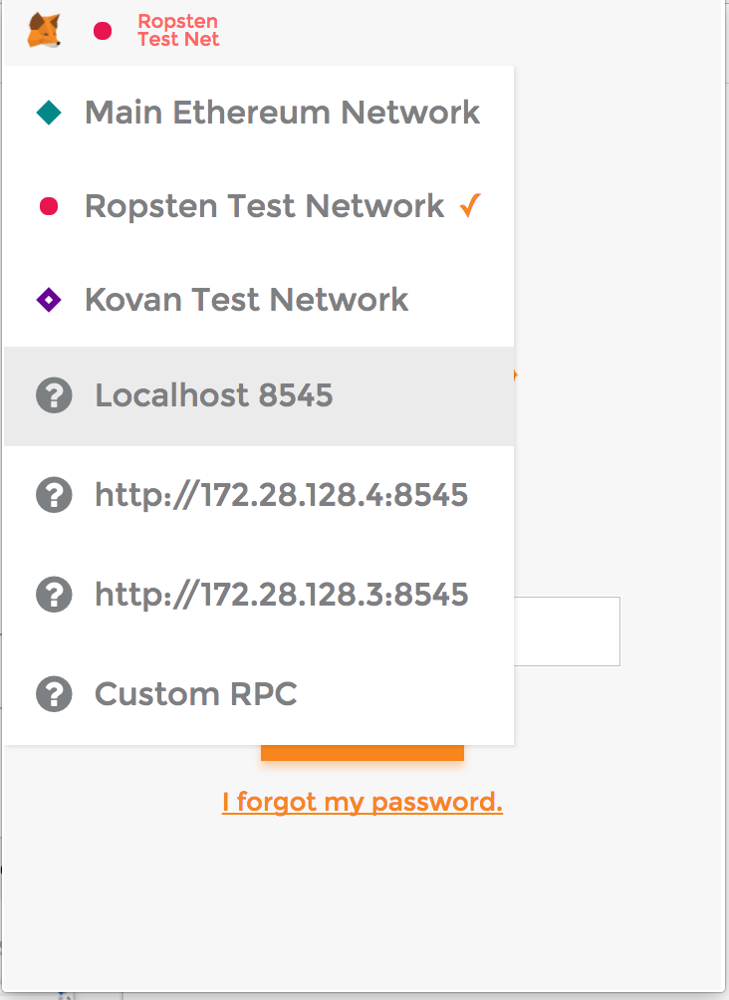

# Codelab ethereum

## Pré-requis
Pour ce TP vous aurez besoin :

1. D'un éditeur de texte ou un IDE. S'il prend en charge le javascript c'est mieux : [Visual Studio Code](https://code.visualstudio.com/), [Atom](https://atom.io/), [Notepad++](https://notepad-plus-plus.org/fr/), [Sublime Text](https://www.sublimetext.com/)...

2. D'une version récente de docker : [Windows](https://docs.docker.com/docker-for-windows/install/), [Linux](https://docs.docker.com/engine/installation/linux/ubuntu/), [Mac](https://docs.docker.com/docker-for-mac/install/).

3. De [Git](https://git-scm.com/downloads)

4. De Google chrome/Chromium et de [l'extension metamask](https://github.com/MetaMask/metamask-plugin/releases/tag/v3.5.2) (il ne faut pas prendre la dernière version qui est incompatible avec nos librairies actuelles).
Pour installer l'extension, télécharger et dézipper le fichier. Puis glisser déposer le répertoire du plugin dans le corps de la page chrome://extensions/ dans le navigateur Chrome afin de l'installer.

## Installation
```sh
git clone https://github.com/benjaminfontaine/codelab-ethereum.git
cd codelab-ethereum/horse-bet
```
Récupérez l'image docker sur dockerhub via la ligne de commande suivante :
```sh
docker pull francoiskha/codelab-ethereum
```

Ou bien via la clef USB fournie en séance (mode hors connexion) :
```sh
docker load -i <USB-DRIVE>/install-codelab-ethereum/image-codelab-ethereum.tar.gz
```

Installez [l'extension chrome metamask](https://chrome.google.com/webstore/detail/metamask/nkbihfbeogaeaoehlefnkodbefgpgknn)

Vérifiez que tout fonctionne via en lançant depuis la racine du projet :
```sh
docker-compose up -d
docker-compose logs -f unit
```
Vous devez obtenir à la fin du log la mention `3 passing`
Lancez ensuite 
```
docker-compose logs -f web
```
Vous devez obtenir un log sans erreur avec, à la fin, la mention `Listening on port 9000`. Si besoin, [une capture complète du lancement du projet est disponible ici](horse-bet/BUILD.md)

## Plus de détails 
Pour construire l'image docker de zéro reportez vous [à la page dédiée](horse-bet/BUILD.md) (ne le faites pas en séance !).

Pour plus de détails sur l'architecture du projet, [consultez la page dédiée](horse-bet/OVERVIEW.md)

## Les commandes importantes :
Lancer tous les conteneurs (à faire au début)
```sh
docker-compose up
```
Lancer les tests unitaires
```sh
docker-compose run unit
```
Consulter les logs de l'application web (option `-f` pour `tail`)
```sh
docker-compose logs web 
```
Redémarrer l'application web
```sh
docker-compose restart web 
```

## Etape 1 : Lire des données dans la blockchain

Se mettre sur la branche :

     git checkout starter-1

Dans cette partie, nous avons rajouté une méthode getInfosCourse dans le contrat `contacts/MonTierce.sol`. Cette méthode va permettre de consulter des données sur une course.
Il y a un commentaire `FIX_ME` dans le corps de cette méthode, à vous de l'implémenter.
Vous pouvez exécuter des tests via la commande 

    docker-compose run unit
    
Ils vous aideront à déterminer si votre code fonctionne ou non comme attendu.

Pour voir la correction de ce TP :

     git checkout starter-1c

## Etape 2 : stocker des données dans la blockchain

Nous pouvons créer et consulter les informations d'une course, nous pouvons passer à l'étape suivante : la 
fonctionnalité de parier.

Tout d'abord charger la deuxième partie du TP :

     git checkout starter-2

Dans le contrat `contacts/MonTierce.sol`, il y a un nouveau commentaire `FIX_ME` qui vous indique la signature de la 
fonction attendue.
Il s'agit d'une méthode publique qui va permettre au parieur de miser un tierce une certaine somme d'argent. Stocke 
ce pari dans la course.

De la même manière que l'exercice 1, exécutez les tests unitaires pour vérifier que votre code fonctionne comme attendu.

Pour voir la correction de ce TP :

     git checkout starter-2c


## Etape 3 - Une fonctione d'administration

     git checkout starter-3

Dans le contrat `contacts/MonTierce.sol`, il vous faut maintenant implémenter une fonction permettant d'interdire 
les paris.
Le contenu de la fonction est simple, un attribut est prévu sur la course pour interdire un nouveau pari mais attention, 
cette fonction ne doit pouvoir être utilisée que par l'administrateur, c'est à dire le compte n°1.

De la même manière que l'exercice 1, exécutez les tests unitaires pour vérifier que votre code fonctionne comme attendu.

Pour voir la correction de ce TP :

     git checkout starter-3c

## Etape 4 : Envoyer des données depuis l'IHM vers le smart contract

Nous voila de retour dans un domaine un peu plus connu, l'IHM de la D-app.
L'avantage de truffle c'est qu'il va utiliser le framework Javascript WEB3, avec la surcouche Ether Pudding pour appeler le contrat, depuis nos fichier js ou ts.
La bonne nouvelle, c'est que c'est exactement les mêmes surcouches qui sont utilisée dans les tests que nous avons fait jusqu'à présent.
Par conséquent, vous connaissez déjà la syntaxe.

L'IHM est en Angular 2 mais libre à vous d'utiliser n'importe quelle autre techno web.
J'ai utilisé la base du projet https://github.com/blacksonic/angular2-babel-esnext-starter pour notre IHM.

Cela fournit une IHM Angular de base en ES6, servie par un serveur koa, avec liveReload et contruite avec gulp et webpack.


#### Lancement de l'IHM

Rechargons maintenant la branche d'origine et jouons un peu avec l'ihm :

     git checkout starter

```sh
docker-compose start web
```

Consultez [http://localhost:9000](http://localhost:9000/) dans votre google chrome.

<aside class="notice">
Si vous utilisez la docker toolbox sur votre machine (Windows ou Mac), l'url suivante ne fonctionnera pas.
Cela est dû au fait que Docker tourne sur une vm Linux créée sur virtual box.
L'ip à utiliser est donc l'ip de cette vm, vous pouvez la récuperer avec la ligne de commande suivante :

```sh
docker-machine ip default
```

L'url sera alors la suivante : http://ip-vm:9000
</aside>

Cliquer sur l'icone de l'extension chrome Metamask en haut à droite de votre fenêtre (un renard orangé). 

Pour pouvoir interfacer Metamask avec votre blockchain RPC, il faut le configurer.

Attention, Metamask se connecte par défaut à une blockchain de test nommée Ropsten. Ce que nous souhaitons, nous, c'est nous connecter à testrpc. Dans la fenêtre de Metamask, cliquez en haut à gauche à côté de l'icône du renard pour faire apparaître le menu des blockchains où se connecter.



* Si vous utilisez docker natif il faut sélectionner `localhost:8545`
* Si vous utilisez une VM (i.e. docker toolbox) il faut sélectionner `Custom RPC` puis entre l'ip de votre VM et le port 8545.

Sur l'écran de connexion (écran disponible de base ou accessible via Menu Lock puis Back), choisir l'option *Restore existing Vault*.
Il vous sera demandé douze mots clés permettant de récupérer votre portefeuille ainsi qu'un nouveau mot de passe.

Pour se connecter au démon simulant une blockchain (testrpc), il rentrer les deux mots clés fournis au lancement de testrpc dans la partie Mnemonic (comme c'est un outil de test, ce sont toujours les mêmes) :

     HD Wallet
     ==================
     Mnemonic:      myth like bonus scare over problem client lizard pioneer submit female collect

Si vous êtes en panne d'inspiration pour le mot de passe saissez `ethereum`.

Une fois cette configuration effectuée, vous serez connecté sur la blockchain avec le compte par défaut (qui sera l'owner du contrat).

Vous aurez donc accès à l'interface spécifique du owner (création de course, blocage des paris, déclenchement de la fin de course).

Vous pouvez à tout moment changer d'utilisateur en faisant un switch account dans Metamask afin d'accèder, par la même url, à l'interface de pari et de récupération des gains.

Pour changer de compte, affichez la fenêtre de metamask, cliquez sur *Switch Accounts* en haut à droite, cliquez sur l'icône *+* pour faire apparaître les comptes préconfigurés par le daemon testrpc.

### Etape 4-préquel : Intégration des smart-contrats à l'application

Il n'y a pas d'exercice à cette étape, c'est juste à titre explicatif.

Pour faire interagir notre application avec la blockchain Ethereum, il a quelques pré-requis.

On démarre du project starter Angular2 (https://github.com/blacksonic/angular2-babel-esnext-starter), et on y fait les quelques ajouts suivants :
- ajouter les répertoires *contracts* (nos fichiers .sol) et *migrations* (les scripts de déploiement Truffle) à la racine du projet.
- ainsi que le fichier truffle.js pour que la configuration truffle soit prise en compte.

A partir de là, pour pouvoir utiliser nos smarts contracts dans l'application, la configuration est assez simple.

Tout d'abord, nous avons ajouté un loader webpack spécifique à Truffle *truffle-solidity-loader*.
Ce loader va automatiquement rendre disponible vos ABI Javascript (fichier .sol.js) dans le fichier vendor.js aggrégant toutes les sources Js de l'appli.

Puis nous avons modifié le fichier `tasks/config/webpack.js` en y référençant notre nouveau loader qui prendra en charge les fichiers .sol :
```
module: {
  loaders: [
    {
      ... ,

    {
      test: /\.json$/,
      loader: 'json'
    },
    {
      test: /\.sol/,
      loader: 'truffle-solidity'
    },
  ],
```

Nous pouvez maintenant utiliser faire appel à vos contrats dans les fichiers js.

### Etape 4 : Envoyer des données à notre smart contract depuis l'IHM

Chargeons la branche contenant le premier exercise sur l'ihm :

     git checkout starter-4

Ouvrer le fichier `client/app/core/services/montierce/monTierce.service.js` qui centralise les appels au contrat dans l'application.

Le premier FIX_ME à corriger est l'import du contrat en .sol (le truffle-solidity-loader se chargera pour vous de le rendre disponible en Js) :

     import MonTierce from "../../../../../contracts/MonTierce.sol";

Nous allons ensuite devoir réparer l'appel à la création de course de notre smart contract.

C'est exactement la même syntaxe que le TU , sauf qu'il faut utiliser l'adresse 'window.web3.eth.defaultAccount' dans le champs from. Cette adresse est l'adresse de l'utilisateur qui est actuellement sélectionné dans Metamask.

### Etape 5 : Récupérer des données de notre smart contract pour les afficher dans l'IHM

### Etape 6 : Les réglements des gains aux vainqueurs

Et voila, vous êtes maintenant un débutant aguerri dans le développement d'une application Ethereum.

Attention : les contrats développés dans le cadre de ce TP ne prennent pas en compte les bonnes pratique de sécurisation des contrats (parce que ça les complexifie beaucoup). Je vous encourage donc vivement à connaître et respecter ces régles listées sur la page suivante : https://github.com/ethereum/wiki/wiki/Safety lorsque vous vous lancerez dans l'aventure.


# Annexes
## Le debuggage :
Créer un event pour pouvoir debugger votre contrat :
Dans le test unitaire ou votre IHM :
```javascript
var eventPari = contratTierce.Parier({});
eventPari.watch(function(error, result) {
  // This will catch all Transfer events, regardless of how they originated.
  console.log("Event pari : ");
  console.log(result.args);
});
```

Dans votre smart-contract :
```solidity
...
event Parier(uint idCourse, uint32[3] chevauxTierce, address messageSender, uint mise, uint senderBalance);

function parier(uint idCourse, uint32[3] chevauxTierce) public returns(bool pariPrisEnCompte){
 Parier(idCourse, chevauxTierce, msg.sender, msg.value, msg.sender.balance);

 if(msg.sender.balance < msg.value){
   throw;
 }
 ...
}
```


